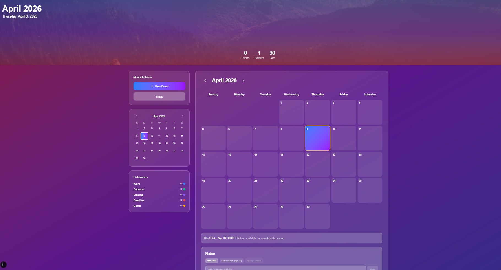
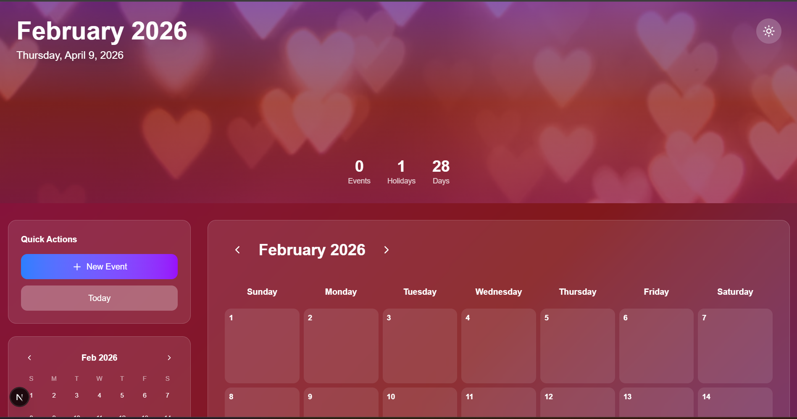
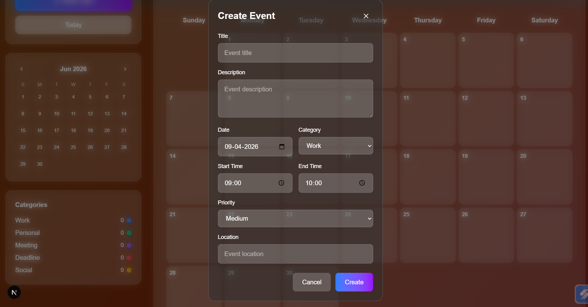
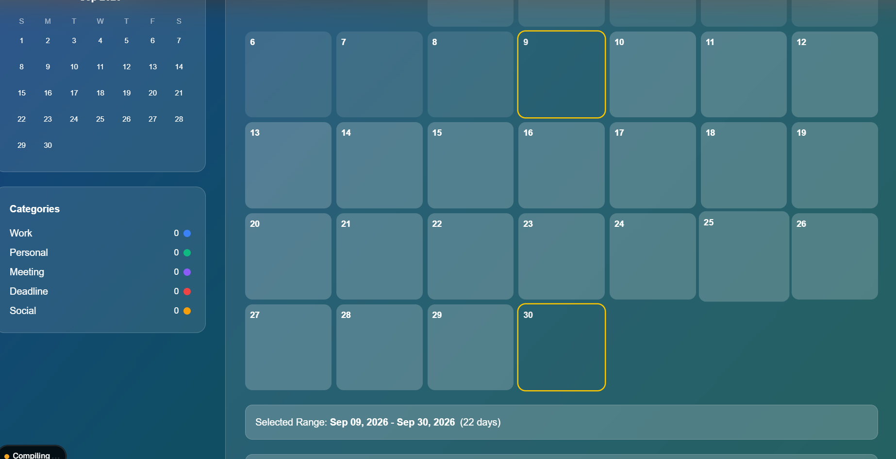
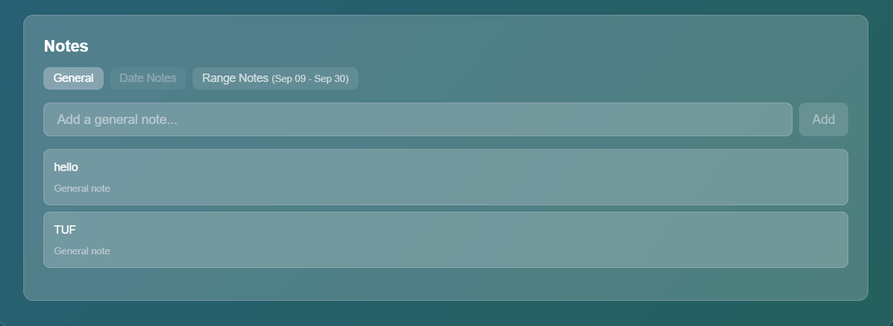

# Interactive Wall Calendar

A sophisticated, fully-featured calendar component built with Next.js, TypeScript, and Tailwind CSS. This project showcases advanced frontend engineering skills with a wall calendar aesthetic, interactive features, and responsive design.

## Features

### Core Requirements
- **Wall Calendar Aesthetic**: Beautiful hero images that change based on the current month
- **Day Range Selection**: Click to select start and end dates with visual feedback
- **Integrated Notes Section**: Add notes to specific dates or general month notes
- **Fully Responsive Design**: Adapts seamlessly between desktop and mobile layouts

### Advanced Features
- **Theme Switching**: Toggle between light and dark modes with smooth transitions
- **Holiday Markers**: Visual indicators for national and cultural holidays
- **Smooth Animations**: Framer Motion powered animations for month transitions and interactions
- **Local Storage Persistence**: Notes and theme preferences are saved locally
- **Touch-Friendly**: Optimized for mobile interactions
- **Visual Date States**: Clear visual hierarchy for selected dates, ranges, and hover states

## Technology Stack

- **Next.js 14** - React framework with App Router
- **TypeScript** - Type safety and better developer experience
- **Tailwind CSS** - Utility-first CSS framework
- **Framer Motion** - Production-ready motion library for React
- **date-fns** - Modern JavaScript date utility library
- **Lucide React** - Beautiful & consistent icon toolkit

## Getting Started

## Project Demo

🎥 **YouTube Demo**: https://youtu.be/fgSRhT-WC_o  

### Front Page


### Different Months View


### Create Event


### Date Range Selection


### Notes Feature



### Prerequisites
- Node.js 18+ 
- npm, yarn, pnpm, or bun

### Installation

1. Clone the repository:
```bash
git clone <repository-url>
cd interactive-calendar
```

2. Install dependencies:
```bash
npm install
# or
yarn install
# or
pnpm install
```

3. Run the development server:
```bash
npm run dev
# or
yarn dev
# or
pnpm dev
```

4. Open [http://localhost:3000](http://localhost:3000) in your browser.

## Usage

### Date Range Selection
1. Click on any date to set the start date
2. Click on another date to set the end date
3. The range will be highlighted with visual indicators
4. Click again to start a new selection

### Adding Notes
1. Select a specific date (optional - notes without date selection apply to the current month)
2. Type your note in the notes section
3. Click "Add" or press Enter
4. Notes are automatically saved to localStorage

### Theme Switching
- Click the sun/moon icon in the top-right corner
- Theme preference is saved and restored on page reload

### Navigation
- Use the arrow buttons to navigate between months
- Hero images change based on the current month
- Smooth transitions between months

## Project Structure

```
src/
  app/
    page.tsx              # Main application page
  components/
    InteractiveCalendar.tsx  # Main calendar component
```

## Component Architecture

The `InteractiveCalendar` component is built with:
- **State Management**: React hooks for managing dates, notes, and UI state
- **Responsive Grid**: CSS Grid for calendar layout with responsive breakpoints
- **Animation System**: Framer Motion for smooth transitions and micro-interactions
- **Data Persistence**: localStorage for notes and theme preferences
- **Type Safety**: Full TypeScript implementation with interfaces

## Key Implementations

### Responsive Design
- Desktop: Side-by-side layout with hero image and calendar grid
- Mobile: Stacked vertical layout with optimized touch targets
- Fluid typography and spacing using Tailwind's responsive utilities

### Animation Features
- Month transition animations with scale and opacity effects
- Hover states on calendar dates
- Smooth theme transitions
- Note appearance animations

### Other Platforms
- **Netlify**: Connect GitHub repository and deploy
- **GitHub Pages**: Build static export and deploy
- **AWS Amplify**: Connect repository and deploy

### Build Command
```bash
npm run build
```

## Browser Support

- Chrome 90+
- Firefox 88+
- Safari 14+
- Edge 90+

## Performance Considerations

- Images are optimized through Next.js Image component
- Component uses React.memo for optimization
- Efficient state management with minimal re-renders
- CSS-in-JS approach with Tailwind for better performance

## Personal Details
 - Name: Summar Porwal
 - Email: summarporwal22@gmail.com
 - Contact: 7974866054

---

**Built with passion for frontend engineering excellence**
